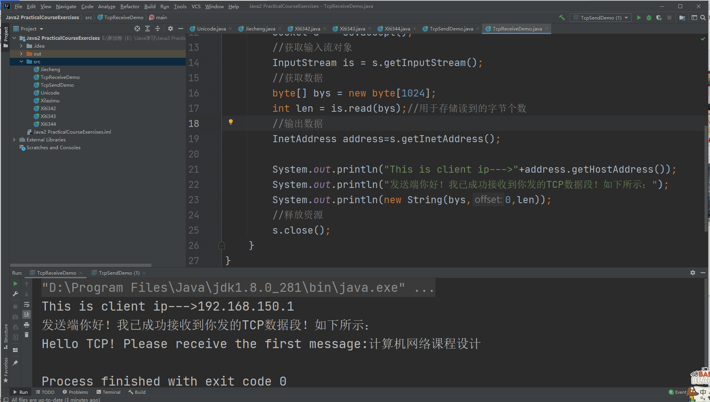

# 🔁 Java实现TCP发送与接收数据通信
```markdown
> 作者：Jia'nan Zhao  
> 时间：2021年6月  
> 技术关键词：Java、Socket、TCP协议、网络编程
```
---

## 📌 项目简介

本项目为《计算机网络》课程设计任务，旨在掌握 TCP 协议的数据通信流程，使用 Java 语言编写简单的 TCP 客户端与服务器端，实现数据发送与接收，并输出通信内容与 IP 信息。

---

## 🎯 项目目标

- 使用 Java Socket 实现基于 TCP 的客户端与服务器通信；
- 客户端向服务端发送数据字段，服务端接收并显示；
- 服务端记录客户端 IP，并反馈接收确认；
- 通过标准输出展示发送与接收过程。

---

## ⚙️ 技术背景

### 🔹 TCP 与 UDP 区别简述

| 项目       | TCP | UDP |
|------------|-----|-----|
| 是否连接   | 面向连接 | 无连接 |
| 可靠性     | 高       | 低（尽最大努力交付） |
| 数据流类型 | 字节流   | 数据报 |
| 速度       | 慢       | 快 |
| 应用场景   | 文件传输、网页浏览 | 视频直播、语音通话 |

### 🔹 三次握手建立连接


```
客户端 → SYN → 服务器
客户端 ← SYN + ACK ← 服务器
客户端 → ACK → 服务器
连接建立成功
```
---

## 🖥️ 通信流程图

```text
客户端(TcpSendDemo)               服务器(TcpReceiveDemo)
--------------------             --------------------------
1. 建立Socket连接   →            1. 启动ServerSocket监听
2. 发送数据         →            2. 接收并读取输入流
3. 输出提示         →            3. 获取客户端IP并输出内容
4. 关闭连接         →            4. 关闭连接
```

---

## 💻 源码展示

### ✅ 客户端 TcpSendDemo.java

```java
import java.io.OutputStream;
import java.io.IOException;
import java.net.InetAddress;
import java.net.Socket;

public class TcpSendDemo {
    public static void main(String[] args) throws IOException {
        Socket s = new Socket(InetAddress.getByName("服务器主机名或IP"), 10086);
        OutputStream os = s.getOutputStream();
        String str = "Hello TCP! Please receive the first message:计算机网络课程设计";
        os.write(str.getBytes());
        System.out.println("发送端已成功发送TCP数据段！请注意在接收端查看！");
        s.close();
    }
}
```

> 🔧 提示：请将 `"服务器主机名或IP"` 替换为你本地的真实服务器地址或 `localhost`。

---

### ✅ 服务器端 TcpReceiveDemo.java

```java
import java.io.InputStream;
import java.io.IOException;
import java.net.ServerSocket;
import java.net.Socket;
import java.net.InetAddress;

public class TcpReceiveDemo {
    public static void main(String[] args) throws IOException {
        ServerSocket ss = new ServerSocket(10086);
        Socket s = ss.accept();
        InputStream is = s.getInputStream();
        byte[] bys = new byte[1024];
        int len = is.read(bys);
        InetAddress address = s.getInetAddress();
        System.out.println("This is client ip---> " + address.getHostAddress());
        System.out.println("发送端你好！我已成功接收到你发的TCP数据段！如下所示：");
        System.out.println(new String(bys, 0, len));
        s.close();
    }
}
```

---

## 🧪 实验效果展示

* **客户端输出：**


```
发送端已成功发送TCP数据段！请注意在接收端查看！
```

* **服务端输出：**



```
This is client ip---> 192.168.x.x
发送端你好！我已成功接收到你发的TCP数据段！如下所示：
Hello TCP! Please receive the first message:计算机网络课程设计
```

---

## 🔍 关键知识点总结

* `Socket` 是建立通信连接的关键类，客户端用来连接服务器，服务器用来监听请求；
* 通过 `getOutputStream()` 和 `getInputStream()` 进行数据写入与读取；
* 使用 `InetAddress.getByName()` 获取远程地址；
* TCP 为全双工协议，保证数据可靠送达，适合文件传输等对可靠性要求高的场景。

---

## 🧠 个人心得

通过此次课程设计，我深入掌握了 TCP 协议的工作流程，强化了网络编程实践技能。尤其是 Socket 的使用、端口监听、数据流处理等，为我今后更复杂的网络开发项目打下了基础。同时也意识到，理论与实践相结合，才能真正掌握技术的本质。

---

## 📚 参考文献

* 沈红、李爱华主编：《计算机网络（第2版）》，清华大学出版社，2015年7月
* Java 官方文档：[https://docs.oracle.com/javase/](https://docs.oracle.com/javase/)

---


